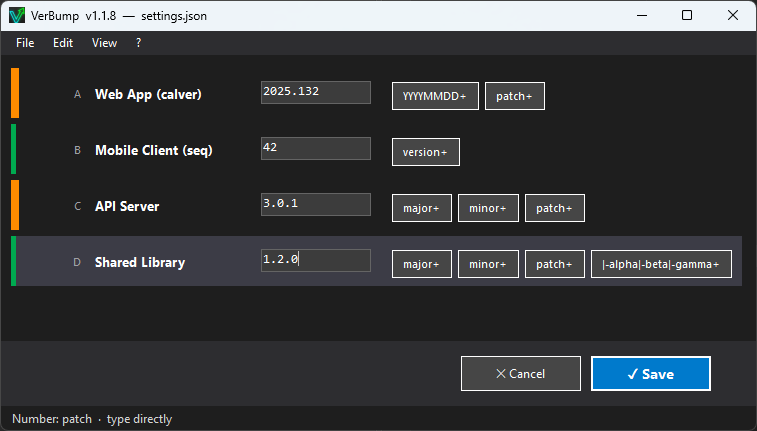
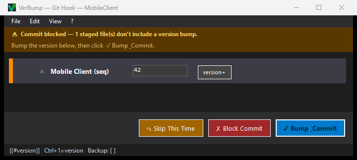

# VerBump

**Version file manager for Windows developers**

[](LICENSE)
[](https://github.com/mbaas2/VerBump/releases/latest)
[](https://github.com/sponsors/mbaas2)

Ever pushed code only to realize you forgot to bump the VERSION file — again?
VerBump keeps all your projects' version state in one view, highlights stale
ones in orange, and lets you bump with a single keystroke — before every push.

→ **[Website & full documentation](https://mbaas2.github.io/VerBump/)**





## Features

- **Staleness detection** — highlights projects where source files are newer than the current VERSION or were updated after last commit
- **Keyboard-driven** — jump to any project with Alt+A–Z, bump with Ctrl+1–4
- **Multiple schemes** — SemVer, CalVer, and custom sequential schemes
- **Flexible ignore rules** — global + per-project, with `!`-prefix exclusion
- **Multilingual** — English and German; add more by dropping a `lang.xx.json` next to the exe
- **Zero dependencies** — single self-contained `.exe`, no .NET runtime installation needed
- **Git pre-commit hook** — install per project from Settings; blocks commits when VERSION is stale
- **Explorer context menu** — right-click a folder or `VERSION` file to open VerBump or silently bump Major/Minor/Patch; optional installer task registers double-click support for extension-less files
- **CLI arguments** — `--check`, `--bump=N`, `--settings=<path>`, or pass a project path directly

## Download

→ **[Latest release](https://github.com/mbaas2/VerBump/releases/latest)**

Windows 10/11 · x64 · Self-contained

## Building from source

Requires [.NET 8 SDK](https://dotnet.microsoft.com/download).

```bash
# Debug build
dotnet build src/VerBump.csproj

# Release — single self-contained exe
dotnet publish src/VerBump.csproj -c Release -r win-x64 --self-contained true -p:PublishSingleFile=true
```

Output: `src/bin/Release/net8.0-windows/win-x64/publish/VerBump.exe`

## Support

Found a bug or have a feature request? [Open an issue](https://github.com/mbaas2/VerBump/issues) or contact me directly at [verbump@mbaas.de](mailto:verbump@mbaas.de) — I'm available for questions, feedback, and the occasional VerBump war story.

VerBump is free and open source (MIT). If it saves you time, consider buying me a coffee or a coffe machine:

[](https://github.com/sponsors/mbaas2)

## License

[MIT](LICENSE) © 2025 Michael Baas
